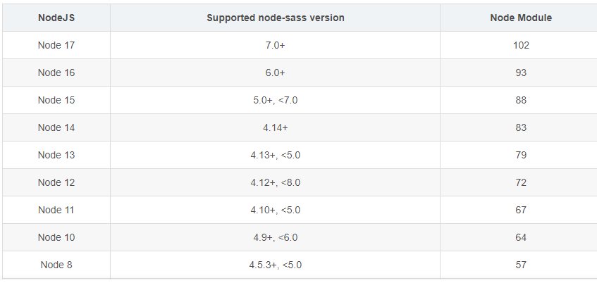

环境
node 14
node-sass:4.12
报错

``` javascript
gyp verb check python checking for Python executable "python" in the PATH
gyp verb `which` failed Error: not found: python
```
node 与node-sass版本对应

最终解决方法：
降低node版本到与node-sass一致