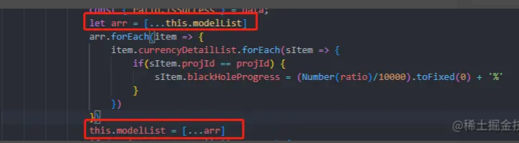

方法收藏
当你觉得你改了数据了，特别是数组那种比较复杂的数据类型，但是页面渲染没有更新，此时你是不是在怀疑，“嗯？说好的数据双向绑定呢？骗人呢？”
我每次遇到这个就会先 ==this.nextTick(() =>{}) #4CAF50==试一波，要是还不知道这个方法的友友们，自己去搜下吧，铁定刚入前端坑没多久哇~
要是还不行的话，我就会[...xxx]

像这样转换下就可以，如果直接this.modelList进行遍历就不管用，必须用arr这种，我觉得跟这玩意是复杂数据类型有关，不能只改变他地址，要改变他本身