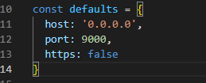

1 修改启动命令
在项目中找到package.json文件，找到

``` javascript
"serve": "vue-cli-service serve",
```
例如将启动命令修改成：npm run dev

``` javascript
"dev": "vue-cli-service serve",
```
2 修改项目启动后的默认端口号
在项目中找到此路径下的文件
node_modules -->  @vue -->   cli-service --> lib -->  commands --> serve.js
找到如下图的port，修改成你需要的端口即可
